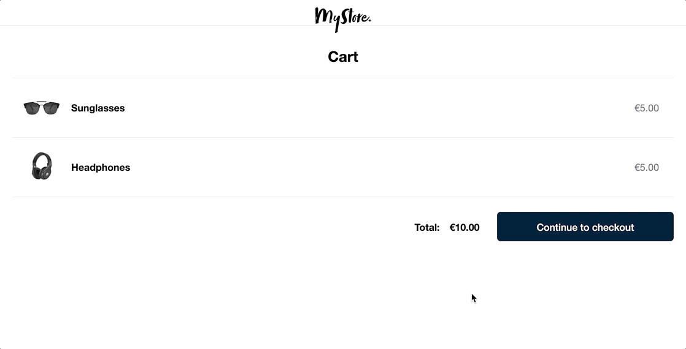

# Adyen [online payment](https://docs.adyen.com/checkout) integration demos

This repository includes examples of PCI-compliant UI integrations for online payments with Adyen. Within this demo app, you'll find a simplified version of an e-commerce website, complete with commented code to highlight key features and concepts of Adyen's API. Check out the underlying code to see how you can integrate Adyen to give your shoppers the option to pay with their preferred payment methods, all in a seamless checkout experience.



## Supported Integrations

**Golang + Gin Gonic** demos of the following client-side integrations are currently available in this repository:

- [Drop-in](https://docs.adyen.com/checkout/drop-in-web)
- [Component](https://docs.adyen.com/checkout/components-web)
  - ACH
  - Card (3DS2)
  - Dotpay
  - giropay
  - iDEAL
  - Klarna (Pay now, Pay later, Slice it)
  - SOFORT

Each demo leverages Adyen's API Library for Golang ([GitHub](https://github.com/Adyen/adyen-go-api-library) | [Docs](https://docs.adyen.com/development-resources/libraries#go)).

## Requirements

Golang 1.14+

## Installation

1. Clone this repo:

```
git clone https://github.com/adyen-examples/adyen-golang-online-payments.git
```

## Usage

1. Create a `./.env` file with all required configuration 

   - PORT (default 8080)
   - [API key](https://docs.adyen.com/user-management/how-to-get-the-api-key)
   - [Client Key](https://docs.adyen.com/user-management/client-side-authentication) 
   - [Merchant Account](https://docs.adyen.com/account/account-structure)

Remember to include `http://localhost:8080` in the list of Allowed Origins

```
PORT=8080
ADYEN_API_KEY="your_API_key_here"
ADYEN_MERCHANT_ACCOUNT="your_merchant_account_here"
ADYEN_CLIENT_KEY="your_client_key_here"
```

2. Start the server:

```
go run -v .
```

3. Visit [http://localhost:8080/](http://localhost:8080/) to select an integration type.

To try out integrations with test card numbers and payment method details, see [Test card numbers](https://docs.adyen.com/development-resources/test-cards/test-card-numbers).

## Run in Docker

Alternatively you can build and run a Docker image

```
# 
docker build -t adyen/golang-online-payments .

# Run image passing env variables
docker run -e "PORT=8080" -e "ADYEN_API_KEY=abc123" -e "ADYEN_MERCHANT_ACCOUNT=TestAccount123" -e "ADYEN_CLIENT_KEY=tyu123" --rm --name adyen-golang-online-payments -p 8080:8080 adyen/golang-online-payments
```


## Contributing

We commit all our new features directly into our GitHub repository. Feel free to request or suggest new features or code changes yourself as well!

Find out more in our [Contributing](https://github.com/adyen-examples/.github/blob/main/CONTRIBUTING.md) guidelines.

## License

MIT license. For more information, see the **LICENSE** file in the root directory.
